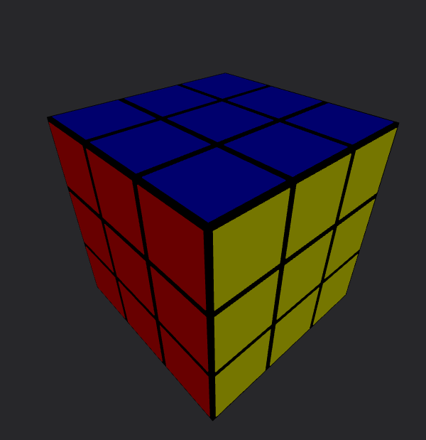
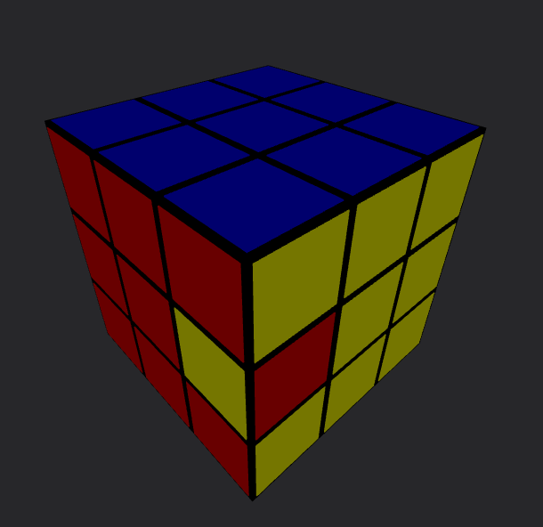
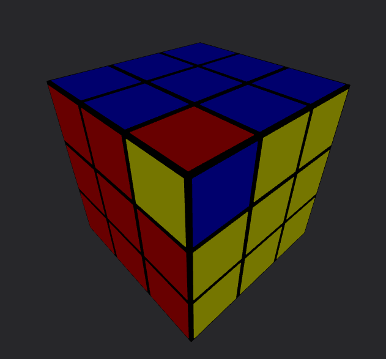
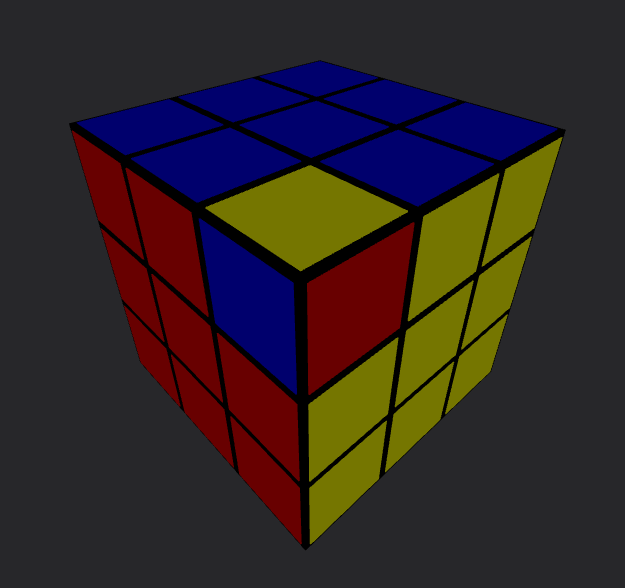
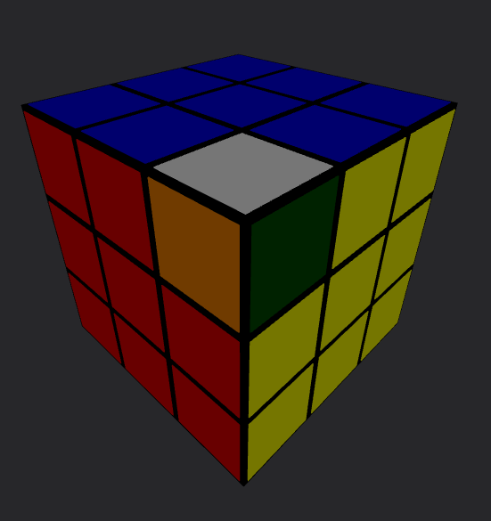
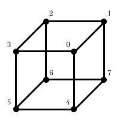
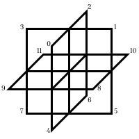

# Rubik's Cube Solver Server - [Link to Interactive Cube](https://cube-solver-frontend.vercel.app/)

The following is python program for solving a rubik's cube. An http server exposes an endpoint that allows a cube configuration to be processed and a sequence of moves will be sent back as a response. The solver uses an implementation of Thistlethwaite's algorithm. The corresponding frontend repository can be found [here](https://github.com/ec-2018/cube-solver-frontend)

## Cube State

An given rubik's cube configuration can be represented by a 40-dimensional vector. This is because a cube contains 20 "cubies" that can change position (center cubies always stay in the same positions in relation to each other). The first 20 values are used to track the position of each cubie while the final 20 values are used to track their orientation.

### Position

Notice how every corner cubie can occupy the position of any other corner cubie and how every edge cubie can occupy the same position as any other edge cubie. Because of this 12 values are used to track the position of the edge cubies and 8 values are used to track the value of the corner cubies. Each cubie is assigned an index within the vector and a corresponding id value that mirrors the index. A turn is represented as the 8 values located at the associated indices of the turning face shifting positions.

For convenience, the 20 position values are split and offset such that a solved cube has the following position values:

```
edges: [0, 1, 2, 3, 4, 5, 6, 7, 8, 9, 10, 11]
corners: [0, 1, 2, 3, 4, 5, 6, 7]
```

Turning a face always rotates 4 indices in each sub-vector. The result of turning the U face on a solved cube looks like this:

```
edges: [1, 2, 3, 0, 4, 5, 6, 7, 8, 9, 10, 11]
corners: [1, 2, 3, 0, 4, 5, 6, 7]
```

### Orientation

Alongside every permutation of position, each cubie can also occupy the same position in multiple orientations. Each corner cubie can be in up to 3 orientations and each edge cubie can be in up to 2. Again, each cubie is assigned to an index in the vector which changes orientation based on which face is turned.

#### Edge Orientation

One might determine edge orientation by first noticing that any edge cubie that is moved and brought back to its original position in an even number of quarter turns maintains its orientation while a cubie that does the same in an odd number of quarter turns has a flipped orientation. Additionally, moving an edge cubie from one position to another in an even number of quarter turns results in the same ending orientation regardless of the sequence of moves made (the same is true for an odd number of quarter turns). So we could flip the orientation of each associated edge cubie in our orientation vector with each quarter turn but we can simplify even further. Notice how if we exclude the use of any two arbitrary parallel faces, no edge cubie can be moved from its position and returned back in an odd number of moves. This means that if we establish a reference frame by selecting two parallel faces, edge orientation can only be changed by quarter turns on those two faces. This implementation uses the front and back faces for edge orientation.

The following represent the edge positions and orientations of solved cube:

```
edge_position:    [0, 1, 2, 3, 4, 5, 6, 7, 8, 9, 10, 11]
edge_orientation: [0, 0, 0, 0, 0, 0, 0, 0, 0, 0, 0, 0]
```

A rotation of the U face results in positions moving but no change in orientations:

```
edge_position:    [1, 2, 3, 0, 4, 5, 6, 7, 8, 9, 10, 11]
edge_orientation: [0, 0, 0, 0, 0, 0, 0, 0, 0, 0, 0, 0]
```

A rotation of the F face results in both positions moving and orientations flipping:

```
edge_position:    [9, 1, 2, 3, 8, 5, 6, 7, 0, 4, 10, 11]
edge_orientation: [1, 0, 0, 0, 1, 0, 0, 0, 1, 1, 0, 0]
```

While the same cubie is in the same position between these two configurations, its orientation is flipped.

 

#### Corner Orientation

Determining corner orientation is more complicated given that a corner can occupy a greater number of orientations. To uniquely define each orientation state, notice that by selecting two arbitrary parallel faces, every corner cubie must contain a color from one of the two faces. For example, most Rubik's cubes have the orange and red faces on opposite sides of the cube. Every single corner piece must contain at least one red or one orange side. (Again the choice is arbitrary, so this is also true for the blue/green sides and the yellow/white sides). The side of the cubie that this color occupies directly maps to the three orientations.

The first image shows a correctly oriented corner of orientation 0.

The second image shows a clockwise or +1 rotation resulting in orientation 1.

The third image shows a counter-clockwise -1 rotation resulting in orientation 2 (which is equivalent to -1 under mod 3).

The fourth image depicts an orientation 0 corner because the orange face lies opposite the red face and the orange facet of the critical cubie is aligned with the red face.

   

We can then notice that under these rules, the orientation of a cubie cannot change by turning either the red or orange sides because turns of this face don't change the positional relationship between the critical facet and the selected face. It also works out that turning any other side changes the orientation of 2 diagonal corner cubies by +1 and the other two by -1.

### Parity

In addition to the 40 values required to uniquely define a cube state, this implementation also tracks the parity of the cube. On a 3x3 Rubik's cube, the parity of the cube will equal the number of quarter turns made on cube mod 2. Thus, parity is tracked by a boolean which is flipped each time a quarter turn is made. A more formal definition for parity can be found [here](https://www.sfu.ca/~jtmulhol/math302/notes/302notes-May07-2012.pdf#Permutations%3A+The+Parity+Theorem).

### CubeState Datatype

For convenience, the 40 values that make up the cube state are tracked in four separate arrays. The following is the full cube state of a solved cube:

```
Corner Position: [0, 1, 2, 3, 4, 5, 6, 7]
Corner Orientation: [0, 0, 0, 0, 0, 0, 0, 0]
Edge Position: [0, 1, 2, 3, 4, 5, 6, 7, 8, 9, 10, 11]
Edge Orientation: [0, 0, 0, 0, 0, 0, 0, 0, 0, 0, 0, 0]
Parity: False
```

And this is the cube state right after making an F turn:

```
Corner Position: [3, 1, 2, 5, 0, 4, 6, 7]
Corner Orientation: [2, 0, 0, 1, 1, 2, 0, 0]
Edge Position: [9, 1, 2, 3, 8, 5, 6, 7, 0, 4, 10, 11]
Edge Orientation: [1, 0, 0, 0, 1, 0, 0, 0, 1, 1, 0, 0]
Parity: True
```

 

## [Thistlethwaite's Algorithm](https://www.jaapsch.net/puzzles/thistle.htm)

Now that we have a rigorous way of uniquely defining every cube state we can start looking for a solution. Simply put, solution is just a series of face turns that transforms a given scramble cube state into the solved cube state. To do this, cube-solving algorithms tend to represent cube states as the nodes of a graph with each type of turn corresponding to the connections between nodes. Unfortunately, a simple graph search algorithm such as DFS or BFS cannot find a solution a feasible time since a Rubik's cube can occupy 43,252,003,274,489,856,000 unique states and each state branches 18 times. Finding an optimal route through this graph can take many hours even on modern hardware and it still requires pre-computed tables to act as a heuristic for A\* search [(Korf's Algorithm)](https://www.cs.princeton.edu/courses/archive/fall06/cos402/papers/korfrubik.pdf). Thistlethwaite's algorithm sacrifices finding the optimal route for much faster calculation speeds. It does this by breaking down the search into sub-problems that search over smaller spaces. It starts by defining five groups (G<sub>0</sub>, G<sub>1</sub>, G<sub>2</sub>, G<sub>3</sub>, G<sub>4</sub>) that progressively place cubies into their proper orientation then position. Each group is a subgroup of the one that precedes it so the properties of all previous groups apply to any group further down the line.

G<sub>0</sub> - All legal cube states \
G<sub>1</sub> - All cube states with correctly oriented edges \
G<sub>2</sub> - All cube states with correctly oriented corners and the equatorial slice edges positioned within the equatorial slice \
G<sub>3</sub> - All the cube states with the middle and standing slice edge cubies positioned within their respective slices as well as each corner positioned within its respective tetrad and overall even parity (more below)\
G<sub>4</sub> - The solved states

After a cube is brought into a group, the moves that would take the cube out of that group are made illegal for the remainder of the algorithm.

G<sub>0</sub> - All moves are legal \
G<sub>1</sub> - Quarter turns on front and back faces are removed because (in the selected reference frame) edge orientation can only be changed on those faces. \
G<sub>2</sub> - Quarter turns on the left and rights faces are removed because this mean corner orientation can no longer be changed. Also, since only half turns are allowed on the front, back, left, and right faces, the edge cubies in the equatorial slice can never leave the slice. \
G<sub>3</sub> - Quarter turns on the up and down faces are removed because with only half turns across the whole cube, corners can no longer switch tetrads and no edge piece can leave its slice. \
G<sub>4</sub> - Done

### Phases and IDs

The algorithm operates in 4 phases that take the cube from group to group. To do this, an ID is assigned to a given cube state that's based on the critical information associated with that phase. This ID is in the form of a string and is used as a node's identifier during graph search. (Cube states are added python dict with their ID as a name for constant time retrieval)

In all but the final phase, the ID is comprised of incomplete parts of the cube-state vector meaning that each ID is not unique; many cube states will map to the same ID depending on the phase. Crucially though, all cube states that share an ID with the solved state also belong in the next group.

The following are the IDs of the solved state at each phase:

```
Phase 1 ID: [0, 0, 0, 0, 0, 0, 0, 0, 0, 0, 0, 0]
Phase 2 ID: [0, 0, 0, 0, 0, 0, 0, 0] ['b', 'b', 'b', 'b', 'b', 'b', 'b', 'b', 'a', 'a', 'a', 'a']
Phase 3 ID: ['b', 'c', 'b', 'c', 'b', 'c', 'b', 'c', 'a', 'a', 'a', 'a'] [0, 1, 0, 1, 4, 5, 4, 5] False
Phase 4 ID: [0, 1, 2, 3, 4, 5, 6, 7, 0, 0, 0, 0, 0, 0, 0, 0, 0, 1, 2, 3, 4, 5, 6, 7, 8, 9, 10, 11, 0, 0, 0, 0, 0, 0, 0, 0, 0, 0, 0, 0]
```

#### Phase 1

Phase 1 aims to take the cube from G<sub>0</sub> to G<sub>1</sub> which means orienting all the edge pieces. Consequently, the the id for this phase uses the 12 values in the "edge orientation" vector of a cube state. A cube state's edge orientation vector must be all 0s to pass to the next phase.

```
Corner Position: [5, 7, 1, 0, 3, 4, 6, 2]
Corner Orientation: [2, 2, 2, 0, 0, 1, 0, 2]
Edge Position: [9, 11, 7, 10, 3, 4, 8, 0, 1, 6, 2, 5]
Edge Orientation: [1, 0, 0, 0, 0, 0, 1, 0, 0, 1, 1, 0]
Parity: True
Phase 1 ID: [1, 0, 0, 0, 0, 0, 1, 0, 0, 1, 1, 0]
```

#### Phase 2

Phase 2 takes the cube from G<sub>1</sub> to G<sub>2</sub> which orients the corners and brings the equatorial slice cubies into the equatorial slice (though not necessarily positioned properly). Like phase 1, the entire corner orientation vector is used in this ID.

Additionally, since the four equatorial cubies need to be positioned with the equatorial slice, the positioning vector is used in the ID as well. But the entire positioning vector cannot be used without modification since we don't need an exact match in position. To do this, the 12 values of the edge positioning vector gets converted into two symbols. Each of the values in the position vector that belong in the equatorial slice are encoded as an "a" and the rest of the positions are encoded as "b". Cube states that share IDs have members of the equatorial slice in congruent positions.

Both these parts are composed together to make the full ID.

```
Corner Position: [1, 4, 7, 6, 3, 5, 2, 0]
Corner Orientation: [2, 2, 1, 0, 0, 2, 0, 2]
Edge Position: [7, 10, 6, 0, 3, 4, 2, 11, 1, 5, 9, 8]
Edge Orientation: [0, 0, 0, 0, 0, 0, 0, 0, 0, 0, 0, 0]
Parity: False
Phase 2 ID: [2, 2, 1, 0, 0, 2, 0, 2] ['b', 'a', 'b', 'b', 'b', 'b', 'b', 'a', 'b', 'b', 'a', 'a']
```

#### Phase 3

Phase 3 takes brings the cube from G<sub>2</sub> to G<sub>2</sub> which positions the remaining edge cubies into their respective slices, ensures overall even parity, and, in Thistlethwaite's original algorithm, brings the corners into their proper tetrad whilst fixing the twist of each tetrad. This implementation uses a stricter condition: each corner must be positioned in its proper pair. (The idea comes from [this](https://www.stefan-pochmann.info/spocc/other_stuff/tools/solver_thistlethwaite/solver_thistlethwaite.txt) author)

The edges being positioned in the correct slices is reflected by a converted edge position vector like we did with in phase 2. This time though, while the equatorial cubies are still encoded as "a", the middle slice cubies are encoded as "b" and the standing slice cubies are encoded as "c".

The four correct corner pairings are (0, 2) (1, 3) (4, 6) (5, 7). Using this, we convert the corner position vector such that each element is represented by 1 of 4 unique symbols that each correspond with a specific corner pairing.

Finally, the overall cube parity is composed with the other two indexes to create the final ID.

```
Corner Position: [4, 6, 7, 2, 5, 1, 3, 0]
Corner Orientation: [0, 0, 0, 0, 0, 0, 0, 0]
Edge Position: [2, 0, 5, 7, 6, 1, 3, 4, 10, 11, 9, 8]
Edge Orientation: [0, 0, 0, 0, 0, 0, 0, 0, 0, 0, 0, 0]
Parity: True
Phase 3 ID: ['b', 'b', 'c', 'c', 'b', 'c', 'c', 'b', 'a', 'a', 'a', 'a'] [4, 4, 5, 0, 5, 1, 1, 0] True
```

#### Phase 4

Phase 4 uses the entire cube state as the ID since this phase needs to solve the cube.

```
Corner Position: [2, 3, 0, 1, 6, 7, 4, 5]
Corner Orientation: [0, 0, 0, 0, 0, 0, 0, 0]
Edge Position: [0, 7, 2, 1, 6, 3, 4, 5, 9, 8, 11, 10]
Edge Orientation: [0, 0, 0, 0, 0, 0, 0, 0, 0, 0, 0, 0]
Parity: False
Phase 4 ID: [2, 3, 0, 1, 6, 7, 4, 5, 0, 0, 0, 0, 0, 0, 0, 0, 0, 7, 2, 1, 6, 3, 4, 5, 9, 8, 11, 10, 0, 0, 0, 0, 0, 0, 0, 0, 0, 0, 0, 0]
```

### Solving

At each phase, the cube is assigned its phase ID. This ID value is compared to the solved ID value and if it matches, the phase is skipped. Otherwise, graph search is started between the two IDs. Again, every legal move (according to the phase) represents travel between nodes of the graph and each node is identified by an ID. Keeping this in mind, a BFS style search algorithm can find the shortest path between groups which translates to a sequence of moves that takes a cube from one group to another. Since the final group contains only the solved cube, this sequence of moves is our solution.

# Helpful Resources

[Morwen Thistlethwaite's Own Explanation](https://www.jaapsch.net/puzzles/thistle.htm)

[Helpful Textbook on Permutation Puzzles and Cubology](https://www.sfu.ca/~jtmulhol/math302/notes/302notes-May07-2012.pdf)

[Concise C++ Implementation](https://www.stefan-pochmann.info/spocc/other_stuff/tools/solver_thistlethwaite/solver_thistlethwaite_cpp.txt)
